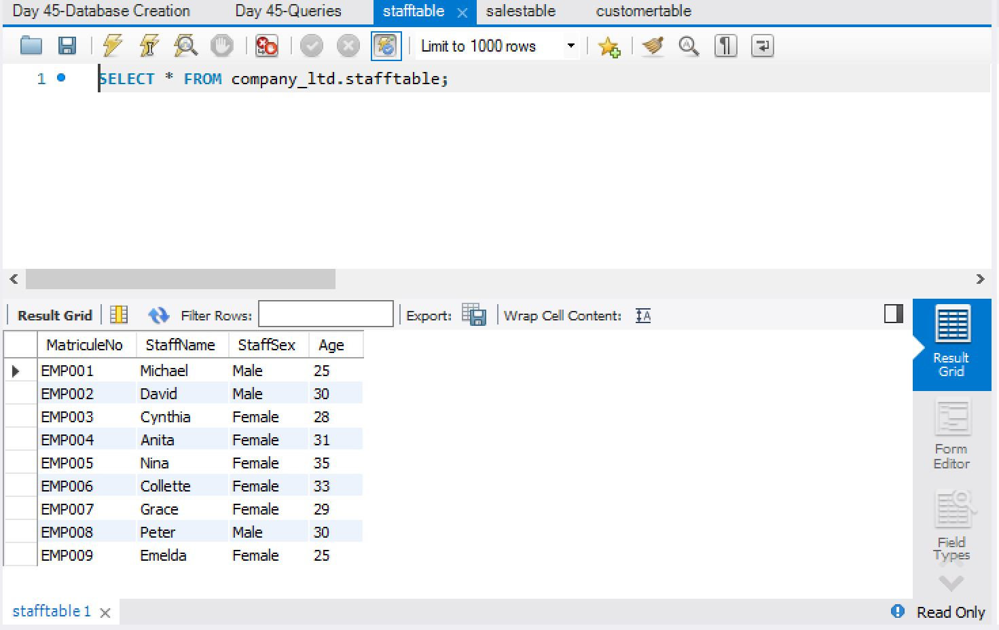

# Exploratory Data Analysis Project

This project permits us to explore data by writing some SQL queries and get some insight from it. The result can help in decision making. 

1. The file "Information to be Searched" contains the questions to be answered using SQL 
2. The file "Database Creation" contains the code to run and create the database and tables required to answer the questions.
3. The file "Queries" contains all the queries that answer the questions in the mentioned file above.

The Database Management System (DBMS) used is ***MySQL***.

---

The database contains three tables

## 1. Staff table

## 2. Customer table

## 3. Sales table

Some of the queries can be seen in the image below

